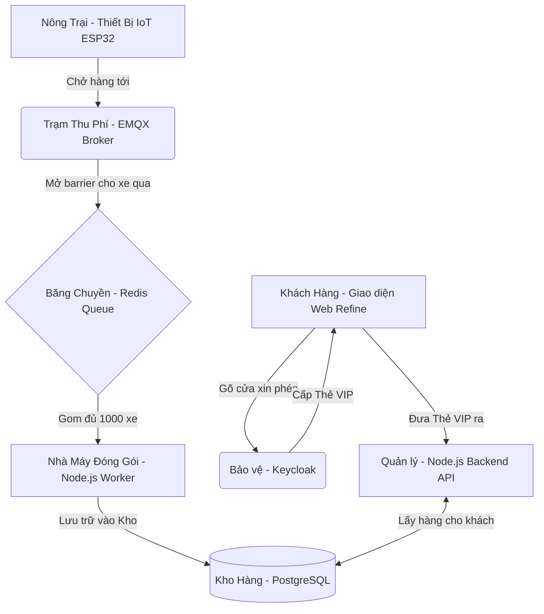

# 📚 TÀI LIỆU HƯỚNG DẪN HỆ THỐNG IOT CHUYÊN NGHIỆP (GREENIQ)

Chào mừng bạn đến với tài liệu hướng dẫn hệ thống IoT toàn diện. Tài liệu này giải thích chi tiết toàn bộ các thành phần cấu thành nên hệ thống (Từ Web, Backend đến Máy chủ) theo ngôn ngữ bình dân, dễ hiểu nhất.

---

## 🏗️ 1. SƠ ĐỒ KIẾN TRÚC TỔNG THỂ (AI CŨNG HIỂU ĐƯỢC)

Hãy tưởng tượng hệ thống IoT của chúng ta giống như một **"Hệ sinh thái Siêu thị & Nhà máy"**:



### Giải thích vai trò từng thành phần trong Hệ Sinh Thái:
1. **Giao diện Web Refine (Siêu thị của Khách hàng)**: Đây là trang web để bạn đăng nhập vào xem nhiệt độ, tạo thiết bị mới. Refine giúp việc xây dựng trang quản trị (Admin Panel) cực kỳ nhanh.
2. **Keycloak (Chú Bảo vệ kiêm Máy cấp thẻ)**: Một hệ thống quản lý danh tính độc lập. Khi bạn mở Web lên, Web sẽ đá bạn sang Keycloak để đăng nhập. Nếu đúng tài khoản, Keycloak cấp cho bạn 1 cái "Thẻ VIP" (Token).
3. **Thiết bị IoT (Nông trại)**: Liên tục thu hoạch dữ liệu (Nhiệt độ, độ ẩm) và chở lên mạng.
4. **EMQX (Trạm thu phí MQTT)**: Chịu tải hàng vạn kết nối từ Nông trại.
5. **Redis (Băng chuyền/Hàng đợi)**: Nhận hàng tốc độ ánh sáng, giúp Kho (Database) không bị cháy vì quá tải.
6. **Node.js Worker (Nhà máy đóng gói)**: Gom hàng trên băng chuyền đóng thành 1 thùng to rồi đẩy 1 lần vào Kho.
7. **PostgreSQL (Kho hàng)**: Nơi lưu trữ vĩnh viễn mọi dữ liệu, tổ chức giống hệt kiến trúc của ThingsBoard.

---

## 💻 2. KHỐI GIAO DIỆN WEB (FRONTEND - REFINE)

Thư mục: `src/` (Ngoài cùng)

Giao diện Web của chúng ta dùng **React** kết hợp bộ khung **Refine**. Refine lo hết mọi thứ khó khăn như: Phân trang, Hiển thị bảng, Sắp xếp, v.v...

### Các File Trọng Tâm (Dành cho người xem Code)

#### File: `src/App.tsx` (Bảng điều khiển Trung tâm)
Đây là nơi lắp ráp toàn bộ Web. Nó khai báo các trang (Pages) như: Danh sách thiết bị, Dashboard.
```typescript
// Định nghĩa tài nguyên "Thiết bị"
<Resource 
  name="devices" 
  list={DeviceList} 
  create={DeviceCreate} 
/>
```

#### File: `src/providers/apiDeviceProvider.ts` (Người giao vận của Web)
Khi bạn bấm nút "Tải dữ liệu" trên Web, Web không tự động lấy được, nó phải nhờ người Giao vận (Data Provider) chạy đi lấy.
```typescript
import axios from "axios";

// Mỗi khi Giao vận đi lấy hàng, luôn luôn đính kèm Thẻ VIP (Token) vào Header
axios.interceptors.request.use((config) => {
  const token = localStorage.getItem("keycloak-token"); // Lấy thẻ VIP từ ví (localStorage)
  config.headers["Authorization"] = `Bearer ${token}`; // Đính lên trán rồi mới đi gọi API
  return config;
});

// Lệnh đi lấy danh sách thiết bị từ Quản lý kho (Backend)
export const apiDeviceProvider = {
  getList: async () => {
    const response = await axios.get("http://localhost:3000/devices");
    return response.data;
  }
}
```

---

## ⚙️ 3. KHỐI XỬ LÝ TRUNG TÂM (BACKEND - NODE.JS)

Thư mục: `backend/src/`

Nhiệm vụ của Backend là làm "Quản lý Kho". Chỉ ai có Thẻ VIP thật mới được mở Kho.

#### File: `backend/src/index.ts` (Trái tim của Quản lý Kho)
```typescript
import { expressjwt } from 'express-jwt'; 

// 1. Dựng cổng bảo vệ bằng Express-JWT
const checkJwt = expressjwt({
  // Liên hệ với đường dây nóng của Keycloak để lấy khóa giải mã Thẻ VIP
  secret: jwksRsa.expressJwtSecret({
    jwksUri: 'https://auth.greeniq.vn/realms/master/protocol/openid-connect/certs'
  }),
  algorithms: ['RS256']
});
app.use(checkJwt); // Khóa toàn bộ các API lại!

// 2. API Cấp quyền tạo Thiết bị (POST /devices)
app.post('/devices', async (req, res) => {
  // Tạo Khóa ngẫu nhiên cho thiết bị phần cứng
  const deviceKey = taoChuoiNgauNhien(20); 
  
  // Lưu vào Kho (PostgreSQL) thông qua Prisma
  const thietBiMoi = await prisma.devices.create({ ... });
  res.json({ ...thietBiMoi, device_key: deviceKey });
});
```

#### File: `backend/src/mqtt/mqttClient.ts` (Người lấy hàng từ Trạm thu phí)
```typescript
export const startMqttClient = () => {
  const client = mqtt.connect('mqtt://emqx:1883'); // Nối dây vào EMQX

  client.on('message', async (topic, message) => {
    // Khi thiết bị phần cứng gửi lên kênh telemetry/ABCD
    const deviceKey = topic.split('/')[1]; // Lấy chữ ABCD ra
    
    // Quăng kiện hàng lên Băng chuyền Redis (Lệnh lpush)
    await redis.lpush('telemetry_queue', JSON.stringify({ deviceKey, payload }));
  });
};
```

#### File: `backend/src/workers/telemetryWorker.ts` (Công nhân đóng gói)
```typescript
export const startTelemetryWorker = () => {
  // Đồng hồ báo thức, 1 giây réo 1 lần
  setInterval(async () => {
    // Nhặt 1000 món trên băng chuyền Redis (rpop)
    const messages = await lay_1000_mon_tu_redis();

    // Mở kho Database 1 lần duy nhất, nhét cả 1000 món vào
    await prisma.telemetry_kv.createMany({ data: messages });
  }, 1000); 
};
```

---

## 🚢 4. KHỐI HẠ TẦNG MÁY CHỦ (KUBERNETES - K3S)

Toàn bộ "Nhà máy" này không chạy trên một cái máy tính cùi bắp, mà nó chạy trên **Cụm K3s (Kubernetes)**. K3s giống như một "Thành phố Công nghiệp".

1. **EMQX Pod**: Đây là trạm thu phí chuyên nghiệp của thành phố.
2. **Redis Pod**: Các kho trung chuyển tạm thời (RAM siêu tốc).
3. **PostgreSQL (CNPG)**: Hệ thống Kho lưu trữ công nghệ cao, tự động nhân bản dữ liệu (Cluster) để chống mất mát (chạy bằng toán tử CloudNative-PG).
4. **Backend Pod**: Được đóng gói thành 1 cái "Container" (Giống container chở hàng ngoài cảng). 
   - Đã được đẩy lên mạng (Docker Hub) dưới tên: `vtaboss/vtapro-backend:latest`
   - File cấu hình `vtapro-backend.yaml` sẽ ra lệnh cho Thành phố K3s tải cái Container này về, cắm điện vào chạy, và tự động liên kết (Network) với Redis, EMQX, và PostgreSQL nội bộ.

---

## 🚀 5. HƯỚNG DẪN KẾT NỐI PHẦN CỨNG THẬT (ESP32)

Bây giờ bạn đã có 1 hệ thống hoành tráng, bạn chỉ cần nạp đoạn Code này vào con ESP32 (Arduino) là nó tự động bơm dữ liệu lên.

- **Máy chủ MQTT (Server)**: `emqx.greeniq.vn`
- **Cổng (Port)**: `1883`
- **Tên đăng nhập (Username)**: Để trống
- **Mật khẩu (Password)**: Để trống
- **Chủ đề (Topic) để gửi dữ liệu**: `telemetry/MÃ_BÍ_MẬT_THIẾT_BỊ_CỦA_BẠN` (Lấy mã này từ giao diện Web Refine khi ấn Tạo mới).

**Dữ liệu gửi lên (Chuẩn JSON)**:
```json
{
  "temperature": 28.5,
  "humidity": 75.2
}
```

**BÙM!** Ngay khi ESP32 gửi chuỗi JSON này lên, chỉ trong chưa tới 1 giây, nó đã đi qua EMQX -> rớt xuống băng chuyền Redis -> Bị Node.js Worker hốt trọn -> Nằm vĩnh viễn trong CSDL PostgreSQL -> và cuối cùng hiện lên Đồ thị trên giao diện Web Refine của bạn!
