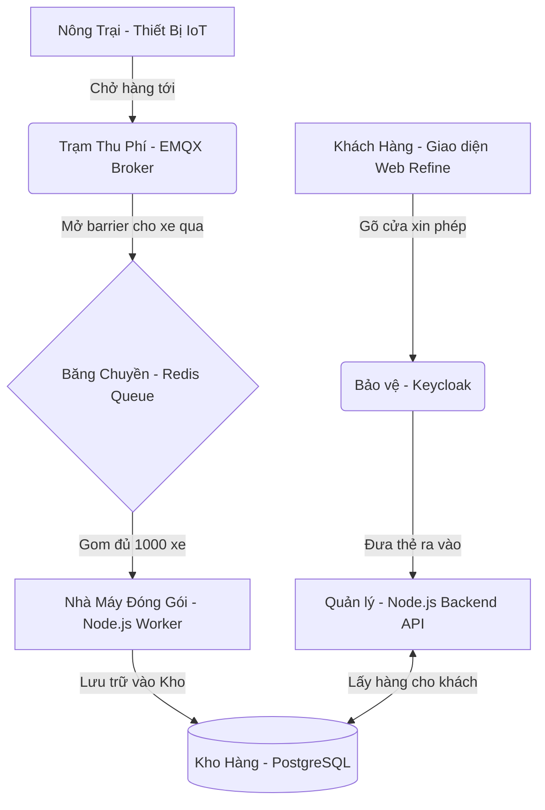

# 📚 TÀI LIỆU HƯỚNG DẪN HỆ THỐNG IOT CHUYÊN NGHIỆP (GREENIQ)

Chào mừng bạn đến với tài liệu hướng dẫn hệ thống IoT. Tài liệu này được viết theo ngôn ngữ bình dân, dễ hiểu nhất để ngay cả những người không chuyên về lập trình cũng có thể nắm bắt được hệ thống đang hoạt động như thế nào.

---

## 🏗️ 1. SƠ ĐỒ KIẾN TRÚC HỆ THỐNG (AI CŨNG HIỂU ĐƯỢC)

Hãy tưởng tượng hệ thống IoT của chúng ta giống như một **"Nhà máy đóng gói nông sản"**:



### Giải thích vai trò từng thành phần:
1. **Thiết bị IoT (ESP32/Arduino)**: Đóng vai trò như các "Nông trại" liên tục thu hoạch dữ liệu (Nhiệt độ, độ ẩm) và chở lên mạng.
2. **EMQX (Trạm thu phí MQTT)**: Đây là một phần mềm siêu mạnh giúp tiếp nhận hàng vạn kết nối cùng lúc. Nó giống như trạm thu phí cao tốc, xe nào có vé (khóa bảo mật) mới được vào. Hiện tại, EMQX đã được bảo vệ bằng hệ thống **HTTP Auth & ACL**, mọi thiết bị bắt buộc phải có tài khoản (Mã thiết bị + Mã bí mật) mới được phép kết nối.
3. **Redis (Băng chuyền/Hàng đợi)**: Thay vì bắt kho hàng (Database) phải mở cửa liên tục để nhận từng gói hàng một (sẽ làm cháy kho), ta để Redis làm băng chuyền chờ. Hàng cứ tới là quăng lên băng chuyền với tốc độ ánh sáng (Vài micro-giây).
4. **Node.js Worker (Nhà máy đóng gói)**: Cứ mỗi 1 giây, công nhân ở đây sẽ hốt sạch hàng hóa trên băng chuyền Redis (tối đa 1000 món), đóng thành 1 thùng to và đẩy 1 lần duy nhất vào Kho (Database).
5. **PostgreSQL (Kho hàng)**: Nơi lưu trữ vĩnh viễn mọi dữ liệu, không bao giờ bị quá tải nhờ có Băng chuyền và Nhà máy phía trước bảo vệ.
6. **Keycloak (Chú bảo vệ)**: Khi bạn mở Giao diện Web, chú bảo vệ này sẽ kiểm tra xem bạn có tài khoản hợp lệ không, sau đó cấp cho bạn 1 cái "Thẻ VIP" (JWT Token).
7. **Node.js Backend API (Quản lý kho)**: Chỉ khi bạn cầm "Thẻ VIP" đưa ra, Quản lý kho mới cho phép bạn lấy dữ liệu ra xem hoặc tạo thêm thiết bị mới.

---

## 📖 2. HƯỚNG DẪN SỬ DỤNG API TỪNG BƯỚC

Hệ thống của chúng ta cung cấp các "Đường dẫn" (API) để giao tiếp. Các API này đều bị khóa chặt bởi Keycloak.

### Bước 1: Lấy Thẻ VIP (Token)
Trong thực tế, khi bạn đăng nhập trên giao diện Web, Web sẽ tự động đi xin Keycloak cái thẻ này cho bạn. Thẻ này là một đoạn mã loằng ngoằng, ví dụ: `eyJhbGciOiJSUzI1...`

### Bước 2: Dùng API Tạo Thiết bị Mới
- **Đường dẫn (URL)**: `POST http://localhost:3000/devices` (Hoặc tên miền thật của bạn)
- **Hành động**: Gọi điện báo quản lý kho tạo 1 thiết bị mới.
- **Yêu cầu bắt buộc**: Phải đính kèm Thẻ VIP vào phần "Header" (Tiêu đề) của cuộc gọi: `Authorization: Bearer <Thẻ VIP của bạn>`
- **Dữ liệu gửi đi**:
  ```json
  {
    "name": "Cảm biến Vườn Lan",
    "type": "Cảm biến nhiệt độ"
  }
  ```
- **Kết quả trả về**: Hệ thống sẽ tự động tạo cho bạn một cái `device_key` (Mã bí mật của thiết bị). Bạn sẽ dùng mã này để nạp vào Code của con chip ESP32.

### Bước 3: Đẩy dữ liệu từ Thiết bị (ESP32) lên hệ thống
Con chip ESP32 không gọi API, mà nó kết nối vào **Trạm thu phí EMQX** thông qua giao thức MQTT.
- **Địa chỉ máy chủ**: Tên miền K3s của bạn (Ví dụ: `mqtt://emqx.greeniq.vn:1883`)
- **Tên đăng nhập (Username)**: Mã bí mật thiết bị (`DEVICE_KEY`)
- **Mật khẩu (Password)**: Mã bảo mật (`SECRET_TOKEN`)
- **Tên chủ đề (Topic)**: `v1/devices/MÃ_BÍ_MẬT_CỦA_THIẾT_BỊ/telemetry`
- **Dữ liệu gửi lên**:
  ```json
  {
    "temperature": 30.5,
    "humidity": 80
  }
  ```
Lập tức, dữ liệu này sẽ chạy qua băng chuyền và nằm gọn gàng trong Database.

### Bước 4: Xem Dữ liệu Telemetry (GET)
- **Đường dẫn (URL)**: `GET http://localhost:3000/devices/MÃ_ID_THIẾT_BỊ/telemetry`
- **Hành động**: Lấy danh sách lịch sử đo lường (nhiệt độ, độ ẩm...) của một thiết bị cụ thể.
- **Kết quả trả về**: Một danh sách các điểm dữ liệu được sắp xếp theo thời gian mới nhất.
  ```json
  [
    { "key": "temperature", "value": 30.5, "lastUpdate": "2026-07-27T08:45:24.581Z" },
    { "key": "humidity", "value": 80, "lastUpdate": "2026-07-27T08:45:24.659Z" }
  ]
  ```

### Bước 5: Xóa Thiết Bị và Dọn Rác (DELETE)
- **Đường dẫn (URL)**: `DELETE http://localhost:3000/devices/MÃ_ID_THIẾT_BỊ`
- **Hành động**: Xóa thiết bị khỏi hệ thống.
- **Cơ chế Cascading Delete**: Theo chuẩn hệ thống IoT (như ThingsBoard), để tránh rác dữ liệu, trước khi xóa thiết bị, hệ thống sẽ tự động quét và **xóa sạch toàn bộ dữ liệu telemetry (đo lường)** của thiết bị đó trong kho chứa (Database), rồi mới xóa thiết bị.
- **Kết quả trả về**: `{ "success": true }`

---

## 🔍 3. GIẢI THÍCH CODE CHI TIẾT (CHO NGƯỜI KHÔNG CHUYÊN)

Dưới đây là phần giải thích mã nguồn (Code) trong Backend của chúng ta. Đừng lo lắng nếu bạn thấy các dòng code khó hiểu, hãy đọc dòng giải thích tiếng Việt ngay bên dưới nó.

### File: `backend/src/index.ts` (Trái tim của Quản lý Kho)
```typescript
import express from 'express'; // Nhập bộ công cụ giúp tạo máy chủ Web
import cors from 'cors'; // Nhập công cụ cho phép Web ở tên miền khác gọi được vào API này
import { expressjwt } from 'express-jwt'; // Nhập công cụ "Bảo vệ" kiểm tra Thẻ VIP (Token)
import jwksRsa from 'jwks-rsa'; // Nhập công cụ liên hệ với Keycloak để xác minh Thẻ VIP là đồ thật

const app = express(); // Tạo ra một ứng dụng Web
app.use(express.json()); // Bật tính năng cho phép ứng dụng đọc hiểu dữ liệu định dạng JSON

// ----- PHẦN KIỂM TRA BẢO VỆ -----
const checkJwt = expressjwt({
  // Liên hệ với đường dây nóng của Keycloak để lấy khóa giải mã
  secret: jwksRsa.expressJwtSecret({
    jwksUri: 'https://auth.greeniq.vn/realms/master/protocol/openid-connect/certs'
  }),
  issuer: 'https://auth.greeniq.vn/realms/master', // Đảm bảo thẻ VIP phải do đúng trụ sở này cấp
  algorithms: ['RS256'] // Sử dụng thuật toán mã hóa siêu chuẩn
});
app.use(checkJwt); // Bắt buộc mọi người truy cập vào đây đều phải đi qua khâu kiểm tra Thẻ VIP

// ----- PHẦN LÀM VIỆC CỦA QUẢN LÝ (API) -----
// Khi có người yêu cầu tạo Thiết bị (POST /devices)
app.post('/devices', async (req, res) => {
  const data = req.body; // Lấy thông tin mà khách gửi lên (Tên, loại thiết bị)
  
  // 1. Tạo ra 2 chuỗi ký tự ngẫu nhiên, dài và rất khó đoán để làm Khóa (Key) và Mật khẩu (Secret)
  const deviceKey = taoChuoiNgauNhien(20); 
  const secret = taoChuoiNgauNhien(32);

  // 2. Lưu vào Sổ cái (Database - Bảng devices)
  const thietBiMoi = await prisma.devices.create({
    data: { name: data.name, ... }
  });

  // 3. Trả lại thông tin cho khách, bao gồm cả cái Khóa (Key) để họ mang về nạp vào phần cứng
  res.json({ ...thietBiMoi, device_key: deviceKey });
});

// Khi khách yêu cầu xem lịch sử đo lường (GET /devices/:id/telemetry)
app.get('/devices/:id/telemetry', async (req, res) => {
  // Lấy dữ liệu từ bảng telemetry_kv sắp xếp theo thời gian mới nhất
  const telemetryData = await prisma.telemetry_kv.findMany({
    where: { entity_id: req.params.id },
    orderBy: { ts: 'desc' }
  });
  res.json(telemetryData);
});

// Khi khách yêu cầu xóa Thiết bị (DELETE /devices/:id)
app.delete('/devices/:id', async (req, res) => {
  // 1. Quét dọn rác: Xóa toàn bộ dữ liệu đo lường của thiết bị này trước (Cascading Delete)
  await prisma.telemetry_kv.deleteMany({
    where: { entity_id: req.params.id }
  });

  // 2. Sau khi đã sạch rác, tiến hành xóa thiết bị
  await prisma.devices.delete({
    where: { id: req.params.id }
  });
  
  res.json({ success: true });
});
```

### File: `backend/src/mqtt/mqttClient.ts` (Người lấy hàng bỏ lên băng chuyền)
```typescript
import mqtt from 'mqtt'; // Công cụ kết nối với Trạm thu phí EMQX
import { redis } from '../redis/redisClient'; // Băng chuyền Redis

export const startMqttClient = () => {
  const client = mqtt.connect('mqtt://emqx:1883'); // Kết nối vào EMQX

  client.on('connect', () => {
    // Xin phép Trạm thu phí cho phép tôi lắng nghe tất cả các kênh telemetry của mọi thiết bị
    client.subscribe('v1/devices/+/telemetry');
  });

  // Khi có một kiện hàng (Tin nhắn) chạy tới
  client.on('message', async (topic, message) => {
    // Tách cái tên kênh ra để lấy cái Mã thiết bị. Ví dụ: v1/devices/ABCD/telemetry -> lấy được ABCD
    const deviceKey = topic.split('/')[2]; 
    const payload = JSON.parse(message.toString()); // Mở kiện hàng ra xem bên trong có gì (Ví dụ: nhiệt độ)

    // Đóng gói lại kiện hàng, ghi rõ Mã thiết bị và Thời gian nhận hàng
    const queueItem = {
      deviceKey: deviceKey,
      dulieu: payload,
      thoigian: new Date().getTime()
    };

    // QUAN TRỌNG: Quăng mạnh kiện hàng này lên băng chuyền Redis (Lệnh lpush)
    await redis.lpush('telemetry_queue', JSON.stringify(queueItem));
  });
};
```

### File: `backend/src/workers/telemetryWorker.ts` (Công nhân Nhà máy đóng gói)
```typescript
import { redis } from '../redis/redisClient'; // Băng chuyền Redis
import { PrismaClient } from '@prisma/client'; // Công cụ nói chuyện với Kho Database

export const startTelemetryWorker = () => {
  // Lệnh setInterval này giống như đặt đồng hồ báo thức, cứ mỗi 1000 mili-giây (1 giây) là réo 1 lần
  setInterval(async () => {
    
    const messages = []; // Chuẩn bị 1 cái xe đẩy hàng trống
    
    // Lặp 1000 lần để nhặt hàng từ băng chuyền
    for (let i = 0; i < 1000; i++) {
      // Lấy 1 món từ cuối băng chuyền ra (Lệnh rpop)
      const msg = await redis.rpop('telemetry_queue');
      if (!msg) break; // Nếu băng chuyền hết hàng thì ngưng nhặt
      messages.push(JSON.parse(msg)); // Quăng lên xe đẩy
    }

    if (messages.length === 0) return; // Xe rỗng thì đi ngủ tiếp, đợi giây sau

    // Dùng công cụ Prisma để kêu Database mở cửa 1 lần duy nhất
    // Chèn toàn bộ xe đẩy hàng (tối đa 1000 món) vào Kho chỉ trong vòng 1 nốt nhạc
    await prisma.telemetry_kv.createMany({
      data: messages
    });

  }, 1000); // Khoảng thời gian lặp lại: 1 giây
};
```

---
**Tổng kết:** Với bộ tài liệu này, bạn có thể dễ dàng giải thích cho bất kỳ ai về sự đồ sộ, tính năng bảo mật nhiều lớp và khả năng chịu tải hàng chục ngàn thiết bị của hệ thống IoT mà chúng ta đang xây dựng!
